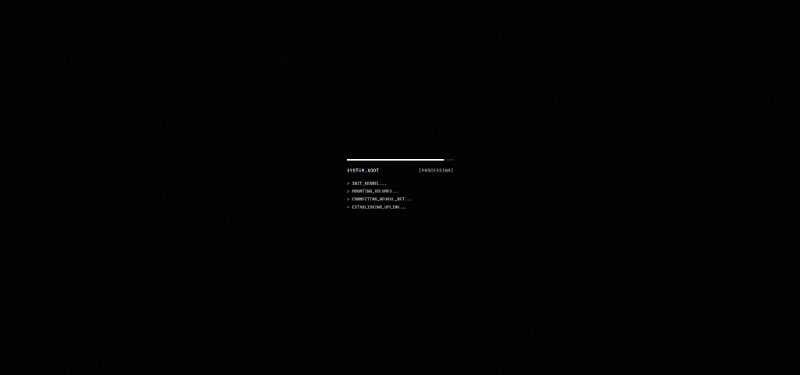
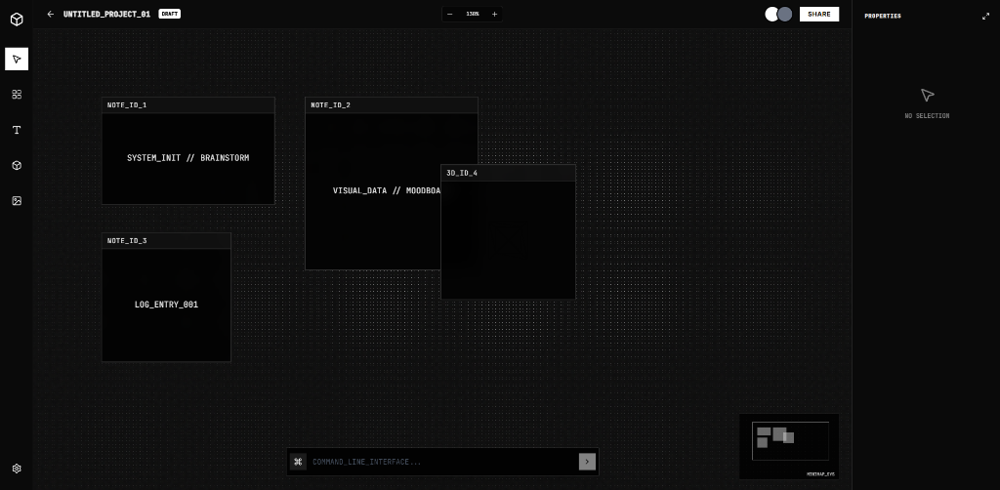

# Thinkspace v2: Fluid Intelligence

Thinkspace is a next-generation workspace that adapts to your mind. It seamlessly transitions between an **Infinite Canvas** for chaotic brainstorming and a **Structured Grid** for organized refinement, all powered by a simulated AI co-pilot.


## The Vision: AI-Driven Interface Design

The "AI-driven" aspect of this interface is designed to demonstrate the *experience* of working with an intelligent partner rather than just a passive tool.

### 1. Contextual Co-pilot
At the heart of the workspace is the **Floating Command Bar**.
*   **Predictive Suggestions**: As you type, the system "guesses" your intent (e.g., `GENERATE_LOGIN_FORM`), mimicking an LLM predicting your next move.
*   **Natural Language**: Creation is treated as a conversation. Instead of hunting for tools, you simply command the system: *"Create a pricing table"*.

### 2. "System" Aesthetic
The design language implies an active, living system:
*   **Boot Sequence**: The loading screen simulates a neural network initialization (`CONNECTING_NEURAL_NET...`), immersing you in the "machine."
*   **Object IDs**: Every item has a technical ID (e.g., `OBJ_REF_#173`), exposing the underlying logic of the system.



### 3. Fluid Mode Switching
The interface adapts to your workflow:
*   **FLOW Mode**: An infinite canvas for unrestricted exploration.
*   **GRID Mode**: A structured layout for refinement.
*   **The Goal**: The AI eventually switches these modes automatically based on your behavior.

### 4. Generative Placeholders
When you use the command bar, the system simulates a "thinking" state before generating content, reinforcing the idea that you are directing an intelligent agent, not just manipulating pixels.



## Key Features

*   **Infinite Canvas**: Pan (Space+Drag) and Zoom (Ctrl+Scroll) to navigate a limitless workspace.
*   **Liquid Grid**: A dynamic background that reacts to your mouse, providing subtle feedback.
*   **3D Integration**: Drag and drop 3D objects directly onto the canvas.
*   **Minimap**: A tactical overview of your entire workspace.

## Tech Stack

*   **Frontend**: React + Vite
*   **3D Rendering**: Three.js, @react-three/fiber, @react-three/drei
*   **Animations**: Framer Motion
*   **Styling**: TailwindCSS + Custom Shaders

## Getting Started

1.  Clone the repository:
    ```bash
    git clone https://github.com/Anxthu/thinkspace.git
    ```
2.  Install dependencies:
    ```bash
    npm install
    ```
3.  Run the development server:
    ```bash
    npm run dev
    ```
